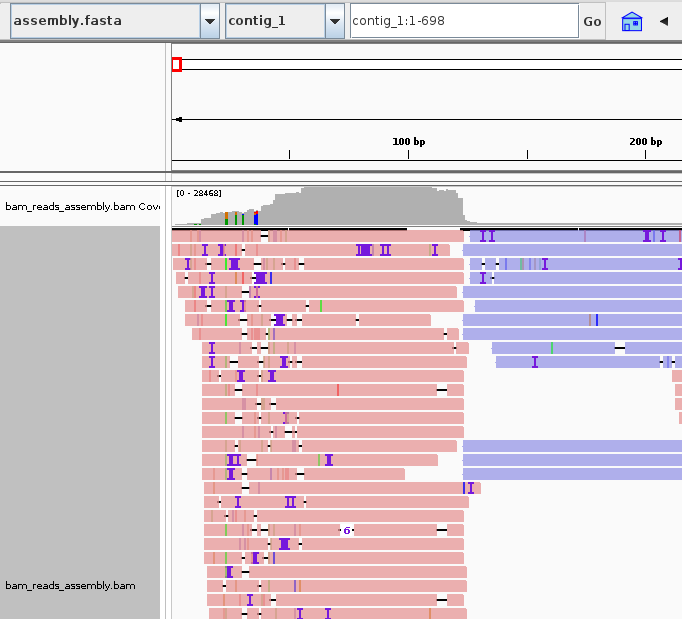
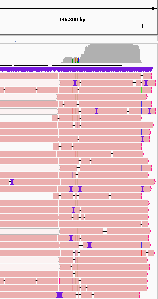
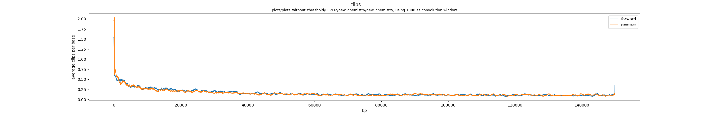
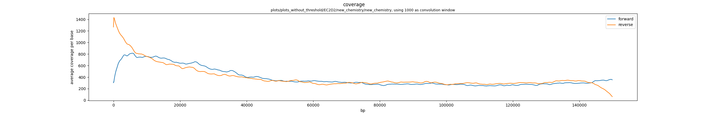
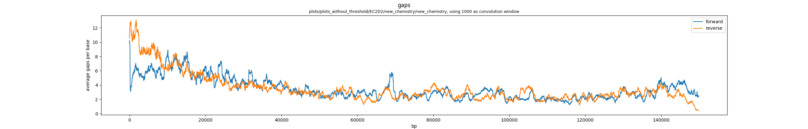
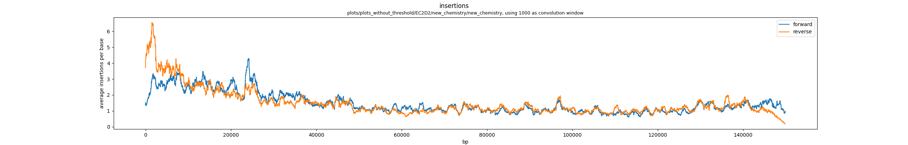
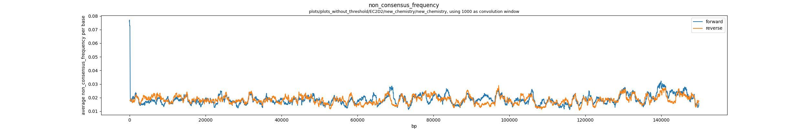

we have finally the first assembly of a phage genome.

we have assembled the EC2D2_new_chemistry.fastq.gz reads. with a reference genome of approximately 163kb

we have used the following flye command:
<pre>
flye --nano-hq /scicore/home/neher/GROUP/data/Giacomo_analysis/raw_data/EC2D2_new_chemistry.fastq.gz \
    --out-dir output_genome_assembly --threads 4 --genome-size 0.163m --asm-coverage 40
</pre>

we have obtained the following output:
<pre>
#seq_name	length	cov.	circ.	repeat	mult.	alt_group	graph_path
contig_1	150850	637	N	N	1	*	*,1,*
</pre>

the sequence doesn't result to be circular, but looking at the alignment with a [reference](https://www.ncbi.nlm.nih.gov/nuccore/MZ501100.1?report=fasta) found by blasting the actual sequence.

the result of the alignment between assembly and reference is: (using minimap2 database_virus_genome.fasta assembly.fasta)

<pre>
distinct minimizers: 28086 (99.85% are singletons); average occurrences: 1.002; average spacing: 5.346; total length: 150425
contig_1	150850	55881	150842	+	MZ501100.1	150425	7	94968	94930	94961	60	tp:A:P	cm:i:17750	s1:i:94930	s2:i:0	dv:f:0.0000	rl:i:0
contig_1	150850	127	55874	+	MZ501100.1	150425	94678	150425	55722	55747	60	tp:A:P	cm:i:10429	s1:i:55722	s2:i:0	dv:f:0.0000	rl:i:0
</pre>

we can produce a sam to take a look at the cigar:

<pre>
contig_1	0	MZ501100.1	1	60	55874S94975M1S	*	0	0
NM:i:3	ms:i:189932	AS:i:189932	nn:i:0	tp:A:P	cm:i:17750	s1:i:94930	s2:i:0	de:f:0.0000	SA:Z:MZ501100.1,94675,+,123S55751M94976S,60,3;	rl:i:0

contig_1	2048	MZ501100.1	94675	60	123H55751M94976H	*	0	0
tp:A:P	cm:i:10429	s1:i:55722	s2:i:0	de:f:0.0001	SA:Z:MZ501100.1,1,+,55874S94975M1S,60,3;	rl:i:0
</pre>

now we have to align the reads with the assembly that we created before. we will do this with minimap2. we use the command minimap2 -ax map-ont ref.fasta reads.fastq > alignment.sam.

then we have to convert sam to bam, we can use the samtools, more specifically samtools sort. then samtools index to be able to look at the bam in igv.

we noticed something weird! the first 127 basepairs are hypercovered and disjoint with respect to the rest of the genome, the blast didn't give a strong match, they are not even part of the nanopore barcodes. they are probably just an assembly artifact.
we have some more information! all of the aligned bases in this region are supplementary, meaning that the main part of the read aligns somewhere and a little overhang aligns at the beginning.
also, almost every read has this sequence as supplementary alignment.
we conclude that the seuqence is indeed part of the nanopore chemistry, maybe our datasets on the chemistry are not enough updated.

the sequence is part of both forward and reverse mapped reads, but it is present only as the plain nucleotide sequence in the dataset, no reverse complement because all the reads that map in the artifact region are forward reads, this is consistent with the fact that the sequence is a barcode.

we have to check also the un aligned mid portion of the sams and the last part. in the middle there is nothing strange. at the end of the sequence there are many reads with a lot of ?. these are secondary alignments, probably the main alignment is at the beginning of the sequence and we have the last part at the end, this is consistent with the fact that the phage genome is circular. the thing is that is difficult to check for this because all the reads have a supplementary alignment for the artifact region.

we have to look at the alignment between the reads and the reference sequence. we can see a peak in the coverage at 8000 bp, it looks like the initial part of the genome. this is due to the biological processes of the phages we are studying, the genome presents a high coverage at a certain position because it linearises and then decreases over time.
the thing is that in this case there is no super covered region, we have at max 2000 of coverage, we have no chemistry artifact, that's because in the reference sequence there is not the sequence of the chemistry.

there is an artifact also in EM60:

we have performed the basecall again with a corrected pipeline, we performed some trial and error tests to figure out which ont options were needed, unfortunately ont doesn't give much data.

the good thing is that the new assemblies are great, we will continue our work on them.

continue this analysis in [another note](note3.md)

### alignment of the assembly with the reference sequences

look at the alignment with the references:
it's good.

EC2D2: https://www.ncbi.nlm.nih.gov/nuccore/MZ501100.1?report=fasta

<pre>
minimap2 -a data/references/EC2D2_reference.fasta results/EC2D2/assemblies/new_chemistry.fasta
contig_1	0	MZ501100.1	1	60	55874S94975M1S	*	0	0	*	NM:i:3	ms:i:189932	AS:i:189932	nn:i:0	tp:A:P	cm:i:17750	s1:i:94930	s2:i:0	de:f:0.0000	SA:Z:MZ501100.1,94675,+,123S55751M94976S,60,3;	rl:i:0
contig_1	2048	MZ501100.1	94675	60	123H55751M94976H	*	0	0	*	NM:i:3	ms:i:111484	AS:i:111484	nn:i:0	tp:A:P	cm:i:10429	s1:i:55722	s2:i:0	de:f:0.0001	SA:Z:MZ501100.1,1,+,55874S94975M1S,60,3;	rl:i:0
</pre>

EM11: https://www.ncbi.nlm.nih.gov/nuccore/MZ501111.1?report=fasta

<pre>
minimap2 -a data/references/EM11_reference.fasta results/EM11/assemblies/new_chemistry.fasta
contig_1	16	MZ501111.1	1	60	45689S10728M1D8346M1I32724M1I31674M1D133M1D74M2D8929M1D2787M1D6M13S	*	0	0	*	NM:i:13	ms:i:190729	AS:i:190728	nn:i:0	tp:A:P	cm:i:17901	s1:i:95318	s2:i:52	de:f:0.0001	SA:Z:MZ501111.1,94973,-,45687M2I95416S,60,6;	rl:i:0
contig_1	2064	MZ501111.1	94973	60	895M1I19426M1I25366M95416H	*	0	0	*	NM:i:6	ms:i:91338	AS:i:91338	nn:i:0	tp:A:P	cm:i:8577	s1:i:45637	s2:i:0	de:f:0.0001	SA:Z:MZ501111.1,1,-,45689S95403M5D13S,60,13;	rl:i:0
</pre>

EM60: https://www.ncbi.nlm.nih.gov/nuccore/MZ501093.1?report=fasta

<pre>
minimap2	VN:2.26-r1175	CL:minimap2 -a data/references/EM60_reference.fasta results/EM60/assemblies/new_chemistry.fasta
contig_1	0	MZ501093.1	1	60	42508S10729M1D8347M1I19003M1D43888M1D74M1D6801M1D5430M140S	*	0	0	*	NM:i:11	ms:i:188478	AS:i:188478	nn:i:0	tp:A:P	cm:i:17718	s1:i:94184	s2:i:0	de:f:0.0001	SA:Z:MZ501093.1,93845,+,42502M6I94413S,60,8;	rl:i:0
contig_1	2048	MZ501093.1	93845	60	945M1I555M1I15457M1I179M1I9834M1I11979M1I3553M94413H	*	0	0	*	NM:i:8	ms:i:84956	AS:i:84956	nn:i:0	tp:A:P	cm:i:7957	s1:i:42448	s2:i:0	de:f:0.0002	SA:Z:MZ501093.1,1,+,42508S94273M4D140S,60,11;	rl:i:0
</pre>

### pileup

finally we will build the pileup graph of the alignment thanks to a script produced by the Neher lab: https://github.com/mmolari/morbidostat-genome-analysis/blob/main/scripts/create_allele_counts.py

command: python build_pileup.py --bam_file results/EC2D2/to_visualise.bam --out_dir pileup_output/ --qual_min 0 --clip_minL 10

we plotted the coverage and the position of the clips for the two alignments, in the forward and reverse direction.
we can notice that in the reverse direction at the beginning there is a high concentration of clips. still not as high as in the igv.

we made plots of much more data: coverage, clips, non consensus freq, insertions and gaps.

there where quite a lot of problems with these graphs:
- convolutions messed up everything (i have to divide for the length of the window.)
- gap graph was missing
- we need labels and titles describing each graph

we can take a first look to the plots from the first sample:

