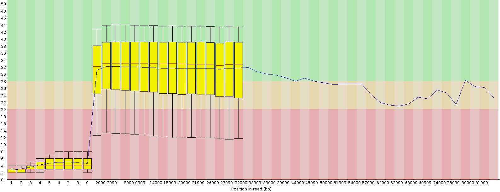

we build a snakemake pipeline.

expand("text_{letter}_{num}.txt", num=[1, 2], allow_missing=True)

read quality per base:

look at the alignment with the references:
it's good.

EM11: https://www.ncbi.nlm.nih.gov/nuccore/MZ501111.1?report=fasta
EM60: https://www.ncbi.nlm.nih.gov/nuccore/MZ501093.1?report=fasta

nanopore qc
rename all envs
