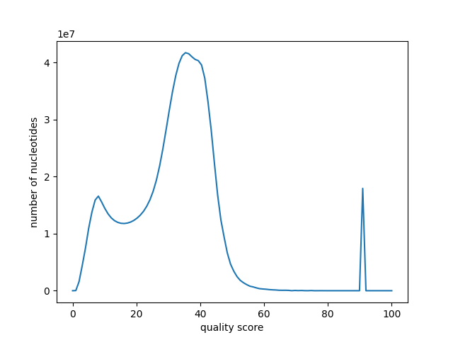

we build a snakemake pipeline.

expand("text_{letter}_{num}.txt", num=[1, 2], allow_missing=True)

once the plots are ok we have to apply the filters on the basis of the distribution of quality and length, we will look at these properties in each sample.

## summary of the data up to now

### fastq statistics
1. the first sample has 32014 reads, with the following quality distribution (since we are working with hundreds of thousands of reads we won't be able to see these plot for the other ones, but we will just consider the score of every nucleotide taken as independent from the others.):

    

    the quality distribution of the nucleotides of this sample is the following:

    
    
    the length of the reads is:

    

2. the second sample has this nucleotide quality distribution, with 226,881 reads:

    

    and this read length distribution

    

3. the third sample has this nucleotide quality distribution:

    

    and this read length distribution

    

### clip length statistics

since we can also put a threshold on the length of the clips it can be useful to look at their distribution

1. 
    
    n of clips 48814
    avg clip len 136.41524972343998
2.
    
    291396
    98.28204917020138
3.
    
    389662
    106.83263956967834

by looking at this data we can state that by filtering for a quality score bigger than 20 we can still keep the majority of the information in the reads.
to clear the data from the barcodes that would influence further analysis we can filter to exclude the clips shorter than 150 bp.

## analysis after the filtering

the plots after the filtering are:

nice but maybe we want to change the convolution window.

## time analysis

we will use the pileup data from different timepoints to make hypothesis on the data.

the plan is to align each the sequencing data at each timepoint of the experiment with the initial assembly and see how it changes from time to time.
thanks to the pileups we will have a measure of each feature.

for each of the parameters we want to define a measure that is higher when the differences from the initial assembly are higher. To do so, it is useful to work with frequencies. We will define frequencies of all the parameters across the genome and we will apply a common manipulation to identify the sites that present a strange behaviour in some parameters.

the parameters are:

1. non consensus frequency

2. clip frequency

3. insertion frequency

4. gap frequency

the idea to compute each of these frequencies was to use the data of the pileup plots (counts of these parameters in the forward and reverse strand). from the forward and reverse counts we can compute the total counts. Then, for each site, we divide the counts for a meaningful normaliser.
in the case of the non consensus frequency the denominator is the total number of nucleotides observed in a certain site. in the case of the clip counts, we can divide them for the number of reads that start mapping at that specific site (clips can happen only at the beginning or the end of a read). in the case of insertions we can normalise for the same coverage as for the non consensus frequency. for the gap counts we need to use a coverage over all the possible observations in a certain sites (including gaps).

this will give us a useful and consistent set of measures, in which, whenever a frequency is high, it means that, in a certain site, a parameter is highly divergent from the assembly data. if we manage to find some sites that experience major changes during the experiment, we could hypothise that such changes are due to evolution.

((((((i was removing elements underneath the coverage threshold from the array, as opposed to sending them to zero.
i was considering as non consensus the gaps))))))

### thresholds

the idea of using frequencies is very smart but it has some problems that we need to predict and avoid.

The first problem regards a sampling bias: our frequencies can be considered as reliable only if they are computed on a large sample size. this means that if we have a low coverage, say 2 or 3 reads, it doesn't matter which frequency we measure, it won't be a reliable measure.

To avoid this problem in the non-consensus frequency, insertion frequency and gap frequency, we can look at the distribution of the coverage and choose an appropriate threshold that prevents us to have many sites with low coverage. (if we set thet threshold to 100 we say that our frequencies will have a precision of 1%, we can trust a lot our measures)

by looking at the graph we can see that in our dataset there are no problems with coverage. unfortunately we are just looking at one phage in one timepoint.

the same reasoning can be applied to clips, we cannot assume that a site has many clips if only one read starts mapping to that site (and it has a clip). we will put a high threshold on the number of reads that have to start mapping in a site to admit the computation of the frequency, this will prevent us to have any measure of clip frequencies (most sites have only one read).

a second problem that we could experience is related to the diversgence between forward and reverse frequencies: it can happen that for some reason we get a very different frequency in the forward and reverse strand, in this case we are not interested in the frequency, even if the total frequency might be high.

Some cases in which such phenomenon can occur in ONT are the methylation sites, in this sites, the methylated strand is read badly while the non methylated is good. in the results we will see a high divergence only due to the methylation, not to an actual mutation.

we can look at the distribution of the divergence between the forward and reverse frequences of all the parameters.

as you can see for some parameters the divergence is more obvious, but in general, by selecting measures that do not show more than 0.2 of divergence we can take the majority of the measures.

### finding the significant sites

after having selected for the meaningful sites, we want to find the significant ones (the ones that have a significant change during the experiment), we will just use a classification method: we will define a function and we will score the sites from the highest to the lowest with respect to the function.

There are many possible functions that we can use to detect a change of frequency over time. if we think of our best possible case, we can imagine it as a site in which at the beginning the frequency is really low (very similar to the consensus of the assembly) and then it spikes up during the experiment, meaning that a mutation has occurred and spreaded in the population.

a function that can express this type of change is the difference between the last and first timepoint.
or the standard deviation of the each measure for the same site over time.
or the difference between lowest and highest timepoint.

these are the resulting plots of the 10 most significant sites for each parameter of each phage:

1. EC2D2
    a. non consensus frequency:
    b. clips
    c. insertions
    d. gaps

2. EM11
    a. non consensus frequency:
    b. clips
    c. insertions
    d. gaps

3. EM60
    a. non consensus frequency:
    b. clips
    c. insertions
    d. gaps

### converting the sites from the assembly to the reference

now we know the exact position of the modified base in the assembly, but unfortunately we have a frameshift, solved with a script.

unfortunately we can only remap to a reference coordinates of assemblies that are mapped forward on the reference.
so we have to find the reverse complement of assemblies that have been assembled in the reverse direction.
then we rerun the mapping to reference rule on snakemake to have the forward mapping.

it should be easy.

gaps:
the assembly site 84166 maps on the reference genome of EM11 at 38473
GGAGTTGGAT
GGAGTTGGAT
the assembly site 89018 maps on the reference genome of EM11 at 43326
AAAAATGTCC
AAAAATGTCC

non consensus sites:
the assembly site 76089 maps on the reference genome of EM11 at 30396
ACCCGTATGG
ACCCGTATGG
the assembly site 82280 maps on the reference genome of EM11 at 36587
ACCCAACCAG
ACCCAACCAG

### BONUS: secondary mapping

we can see the relation between secondary and primary mapping in the reads that have a secondary mapping, it could give us information about genomic rearrangements.

### BONUS: presence of mutations on the same dna molecule

we want to analyse the mutations that we have found from the graphs. we choose mutations that are near

phages=['EM11']
times=['3']
interesting_sites=[82280, 76089]
consensus_sites=['A','A']
genome_limits=[75000,83000]

{'just_1': 60, 'just_2': 74, 'both': 157, 'consensus': 27}
number of reads that span the region with both mutations: 318
{'just_1': 0.18867924528301888, 'just_2': 0.23270440251572327, 'both': 0.4937106918238994, 'consensus': 0.08490566037735849}

phages=['EM11']
times=['5']
interesting_sites=[82280, 76089]
consensus_sites=['A','A']
genome_limits=[75000,83000]

{'just_1': 26, 'just_2': 49, 'both': 106, 'consensus': 24}
number of reads that span the region with both mutations: 205
{'just_1': 0.12682926829268293, 'just_2': 0.23902439024390243, 'both': 0.5170731707317073, 'consensus': 0.11707317073170732}

phages=['EM11']
times=['1']
interesting_sites=[77655, 82934]
consensus_sites=['A','G']
genome_limits=[76000,83000]

{'just_1': 47, 'just_2': 41, 'both': 119, 'consensus': 20}
number of reads that span the region with both mutations: 227
{'just_1': 0.20704845814977973, 'just_2': 0.18061674008810572, 'both': 0.5242290748898678, 'consensus': 0.0881057268722467}

