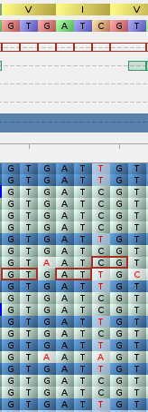

we have found 5 snps between the assembly without barcodes and the reference sequences
they are not caused by technical limitations of nanopore, with our coverage we should be able to get the whole exact genome

they are due to chemical modifications in the dna, bacteria (and therefore phages, whose genome interacts with bacteria) have some methylases that methylate some specific sites

dam methylase GATC
DCM methylase CCAGG

the sites are the following:

sites with mutations with the reference:
90,094 A -> G
144,446 G -> A
96984 C->t
98910 G->a
24323 c->t

as you can see from the image the basecall depends mainly on the direction of the sequenced strand.

24323 GATC/T
90093 AATCA/GACAT
96984 GATC/T
98910 G/AATC
144446 G/AATC

the modified base is the one next to the methylated one, that's strange
dam methylates the A in GATC

also one fo the sequences does not match.

we can try to use a polish tool: medaka

medaka_consensus -i EC2D2_new_chemistry.fastq.gz -d assembly_rev_compl.fasta -o polish_output -m r1041_e82_400bps_sup_v4.2.0

the resulting alignment of the polished assembly with the reference is even worse

<pre>
minimap2 -a EC2D2_reference.fasta polish_output/consensus.fasta
contig_1	0	MZ501100.1	1	60	55766S94977M	*	0	0	*	NM:i:7	ms:i:189912	AS:i:189912	nn:i:0	tp:A:P	cm:i:17740	s1:i:94906	s2:i:0	de:f:0.0001	SA:Z:MZ501100.1,94660,+,55766M94977S,60,5;	rl:i:0
contig_1	2048	MZ501100.1	94660	60	55766M94977H	*	0	0	*	NM:i:13	ms:i:111434	AS:i:111434	nn:i:0	tp:A:P	cm:i:10408	s1:i:55703	s2:i:0	de:f:0.0002	SA:Z:MZ501100.1,1,+,55758S94949M28D,60,30;	rl:i:0
</pre>