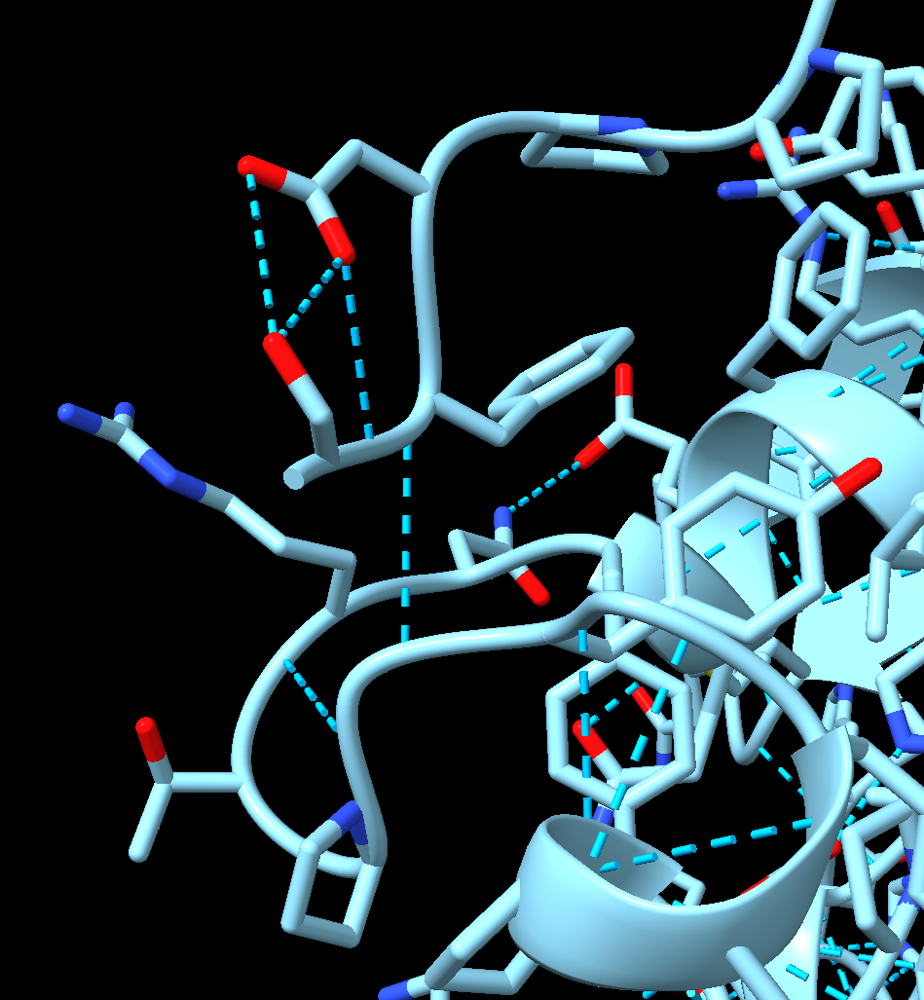
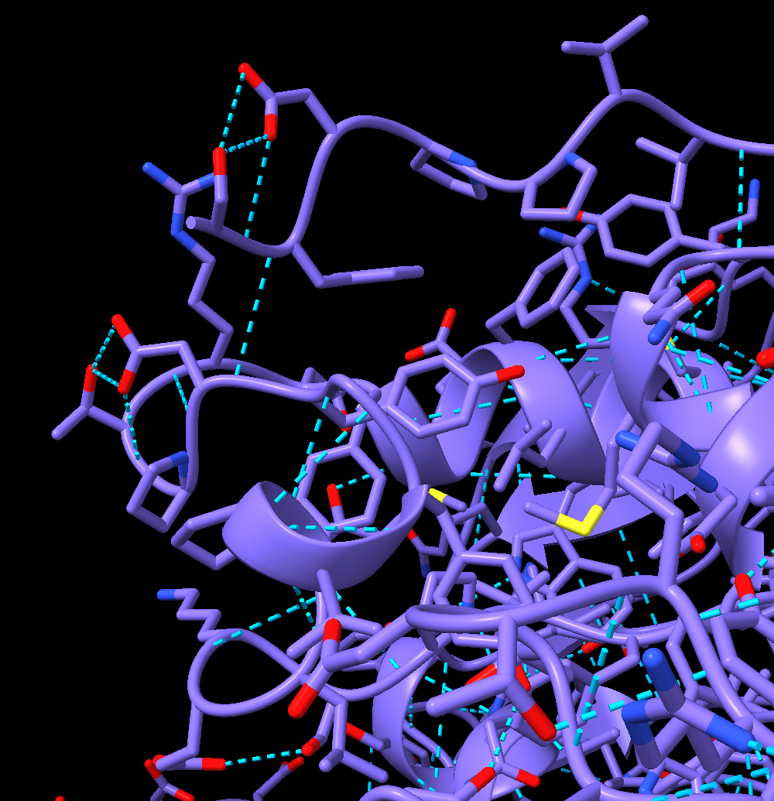

# biological interpretation

from the huge data analysis that we performed we were able to identify some interesting sites in the genome of the phages that were targeted by selective pressure.

Thanks to the genome annotation of these phages we can which are the affected genes:

## summary

| Phage  | type of divergence | position | gene                                                                |
| ------ | ------------------ | -------- | ------------------------------------------------------------------- |
| EM11   | snp                | 36588    | lateral tail fiber protein with glycosidase and deacetylase domains |
| EM11   | snp                | 30397    | lateral tail fiber protein with fibronectin type III domain         |
| EM11   | snp                | 7328     | major capsid protein                                                |
| EM60   | snp                | 36619    | lateral tail fiber protein with glycosidase and deacetylase domains |
| EM60   | snp                | 7695     | major capsid protein                                                |
| EM11   | gap                | 43327    | lateral tail fiber protein with intimin domain                      |
| EM11   | gap                | 38473    | hypothetical protein                                                |
| EM60   | gap                | 28977    | lateral tail fiber protein with fibronectin type III domain         |
| EM60   | gap                | 44969    | lateral tail fiber protein with intimin domain                      |

## EM11

EM11 showed few interesting mutations, two of them follow more or less the same pattern along the days and they affect genes with similar function.

These mutations affect genes involved in the lateral tail fiber protein.

2. the site of EM60 that you found (36619) corresponds to 79121 in my assembly and i discarded it because the coverage was less than 50 and the difference between forward and reverse frequency is 0.33 at timepoint 1. I corrected the thresholds and now i have it in the plot.

3. the sites with non consensus frequency of 0.4 that I found in EM60 map at 7695 and 7696 in the reference genome. they are part of the major capisd protein, they are the first two positions of the last codon of the gene.

4. the sites with gap frequency at 0.3 that I found in EM60 map at 28977 and 44969 in the reference genome. they are part of lateral tail fiber proteins

5. I tried to put a low threshold on the score of the first timepoint but nothing fancy happened

6. I noticed that in the non consensus frequency graph of EM11 there is a site that follows a similar path as the two i found in EM60 (reaching .3 of non consensus frequency). it maps at 7328 on the reference, part of major capsid protein gene.

## aminoacid mutations 
look at aminoacid changes in all mutations 

EM11 82280 aspartate(GAC) to glycine(GGC)
position 618 of the protein

EM60 36619 on reference arginine (AGG) glycine (GGG)
position 621 of the protein

## 3d structure

mutated

non mutated

red line in fastq quality

are methylation sites increasing?